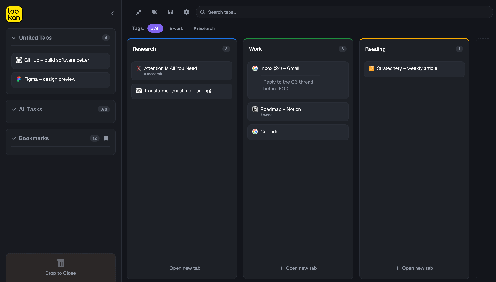

# TabKan

**Your tabs, finally under control.** TabKan turns Chrome's native tab groups into a calm, visual Kanban board — so your browser stops feeling like a junk drawer and starts working like a workspace.

If you live with 40 tabs open across a dozen half-finished trains of thought, you already know the cost: the endless squint across tiny favicons, the "where did that go?" hunt, the dread of closing anything in case you need it later. TabKan gives that chaos a shape you can actually see and move around.

## Why TabKan

- **See everything at a glance.** Every tab group becomes a column; every tab becomes a card on a clean, dark, full-page board. No more scanning a cramped tab strip.
- **Organize by dragging.** Move tabs between groups, pull one out to the unfiled sidebar, or drop into empty space to spin up a new group — it maps straight onto Chrome's real tab groups, so your browser stays in sync.
- **Keep the context, not just the link.** Attach notes, tags, and to‑do lists to any tab. Because the metadata is keyed to the URL, it survives closing and reopening the tab — your thinking isn't lost when the tab is.
- **Find it in a second.** Instant search and tag filters across titles, URLs, notes, and to‑dos surface the one tab you need out of the hundred you have.
- **Never lose a workspace.** Save the whole arrangement — groups, tabs, and bookmarks — as a named session, then restore or export it later. Great for shipping one project and switching to the next.
- **Stay on top of loose ends.** A task roll‑up gathers every to‑do across all your tabs into one list, so half‑finished work doesn't quietly disappear.
- **Work the way you prefer.** Use the full‑page dashboard for a command‑center view, or the lightweight side panel to manage tabs alongside whatever you're reading.

## How it works

TabKan is a Manifest V3 Chrome extension built on the browser's own tab‑group, bookmark, and side‑panel APIs — no accounts, no external services, your data lives in Chrome's local storage. Click the toolbar icon to open the **Dashboard** or the **Side Menu**; right‑click any page for quick access to the board.

## Try it locally

1. Open `chrome://extensions` and enable **Developer mode**.
2. Click **Load unpacked** and select this project folder.
3. Pin TabKan, click its icon, and open the Dashboard.

## Contributing

Contributions, ideas, and bug reports are welcome. TabKan is vanilla JS with no
build step — `npm install` then `npm test` and you're set. See
[CONTRIBUTING.md](CONTRIBUTING.md) for the project layout and workflow, and
[docs/ARCHITECTURE.md](docs/ARCHITECTURE.md) for how the pieces fit together.

Found a security issue? Please report it privately — see [SECURITY.md](SECURITY.md).

## License

[MIT](LICENSE) © [Bjorn Byrne](https://www.bjornbyrne.com)
